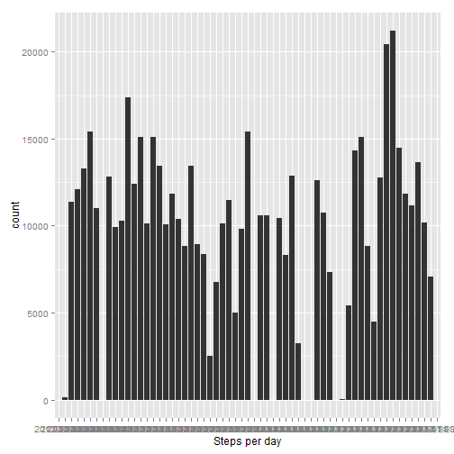
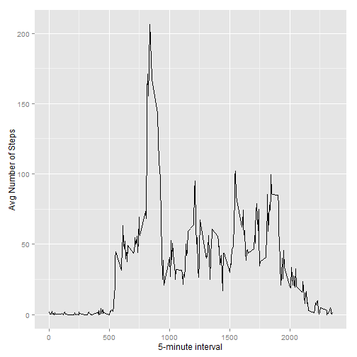
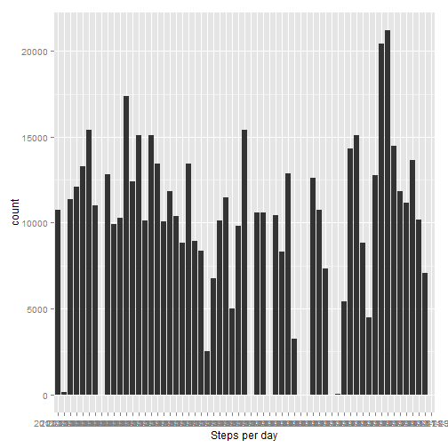
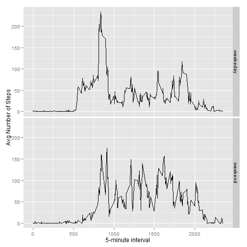

# Reproducible Research: Peer Assessment 1
### Set global options

```r
opts_chunk$set(echo=TRUE)
```

## Loading and preprocessing the data


```r
data <- read.csv("activity.csv")
```

## What is the mean total number of steps taken per day?

### Histogram of total steps per day

```r
library(ggplot2)
qplot(date, weight=data$steps, data=data, xlab="Steps per day")
```

 

### Mean and median total number of steps taken per day


```r
dailySteps <- tapply(data$steps, data$date, FUN=sum, na.rm=TRUE)
mean(dailySteps, na.rm=TRUE)
```

```
## [1] 9354
```

```r
median(dailySteps, na.rm=TRUE)
```

```
## [1] 10395
```

## What is the average daily activity pattern?

### Time series plot: 5-minute intervals, avg number of steps

```r
library(ggplot2)
avgSteps <- aggregate(x=list(steps=data$steps), by=list(interval=data$interval), FUN=mean, na.rm=TRUE)
ggplot(data=avgSteps, aes(x=interval, y=steps)) + geom_line() + xlab("5-minute interval") + ylab("Avg Number of Steps")
```

 

### 5-minute intervals with maximum number of steps

```r
avgSteps[which.max(avgSteps$steps), ]
```

```
##     interval steps
## 104      835 206.2
```

## Imputing missing values

### Total number of missing values in dataset

```r
sum(is.na(data$steps))
```

```
## [1] 2304
```

### Strategy for filling in missing values: daily mean
Replace missing number of steps with average number of steps for appropriate 5-minute interval.

### New dataset with missing values populated

```r
removeNA <- data
removeNA[is.na(removeNA[, 1]), 1] <- avgSteps[is.na(removeNA[, 1]), 2]
```

### Update histogram, mean, and median

```r
qplot(date, weight=removeNA$steps, data=removeNA, xlab="Steps per day")
```

 

```r
dailyStepsUpdated <- tapply(removeNA$steps, removeNA$date, FUN=sum, na.rm=TRUE)
mean(dailyStepsUpdated, na.rm=TRUE)
```

```
## [1] 9531
```

```r
median(dailyStepsUpdated, na.rm=TRUE)
```

```
## [1] 10439
```

### Reactions
The mean and median of the updated dataset are different than those of the initial dataset. The impact of imputing missing data on the estimates of the toal daily number of steps is a higher mean and a higher median. 

## Are there differences in activity patterns between weekdays and weekends?

### Weekday/weekend factor variable

```r
newVariable <- function(date) {
        day <- weekdays(date)
        if(day %in% c("Saturday", "Sunday"))
                return("weekend") 
        else if(day %in% c("Monday", "Tuesday", "Wednesday", "Thursday", "Friday"))
                return("weekeday")
        else stop("invalid date")
}
removeNA$date <- as.Date(removeNA$date)
removeNA$day <- sapply(removeNA$date, FUN=newVariable)
```

### Time series panel plot: 5-minute intervals, avg number of steps

```r
avgStepsNew <- aggregate(steps ~ interval + day, data=removeNA, mean)
ggplot(avgStepsNew, aes(x=interval, y=steps)) + geom_line() + facet_grid(day ~ .) + xlab("5-minute interval") + ylab("Avg Number of Steps")
```

 
